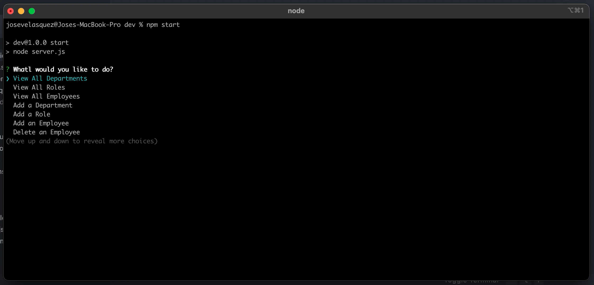

# employees-manager

## Description

this project manage employee from a MySql database. at this moment hava the operation to add, view and update the employee.

## Table of Contents

- [Usage](#usage)
- [Credits](#credits)
- [Questions](#questions)
- [License](#license)

## Usage

clone this project and use npm install to get the node modules. This project required MySql Local inyour machine, please create your env file and add your security information. after execute the schema.sql in the db folder.

## Contributing

You can participate in this project, submiting bugs, and feature request. Also you can help testing this project using jest. Also we want app authentication and authorization to this project.

## Questions

for any questions feel free to contact me to joseduardo15062005@gmail.com

checkout the [GitHub profile](https://github.com/joseduardo15062005)

## License

Code released under the MIT License [License](https://choosealicense.com/licenses/mit/).
for additional questions please feel free to contact us via email at joseduardo15062005@gmail.com
